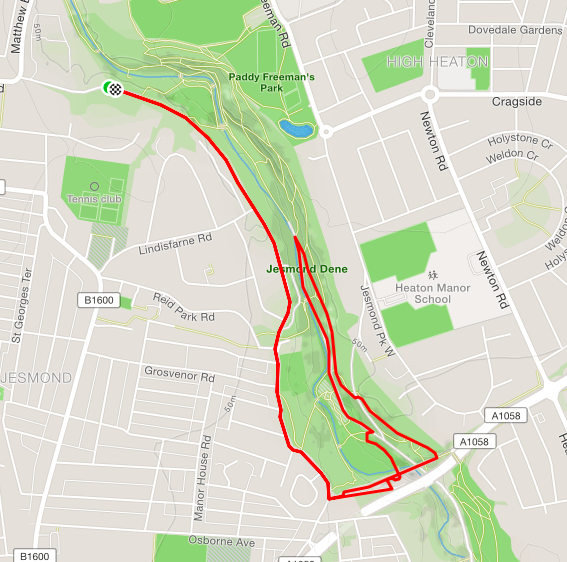

This is the homepage for the Jesmond Joggers Grand Prix, a bi-annual race series running in the Winter and Summer.

The next race takes place on *Monday 23^rd^ April*. The course for the first race will be as below. Starting and finishing at Jesmond Dean House. Please be careful on the short section which is not closed road.

[](https://www.strava.com/routes/12652921)

```{r setup, include=FALSE}
knitr::opts_chunk$set(echo = FALSE, message = FALSE, warning=FALSE)
library(tidyverse)
library(kableExtra)
library(lubridate)
theme_set(theme_minimal())
```

# Latest Results

```{r all-results}
source("scripts/read_results.R")
```

```{r latest-results}
last_handicap = max(all_results$handicap)
season = filter(all_results, handicap == last_handicap) %>% select(season) %>% distinct() %>% .$season
```

Here are the results from handicap `r last_handicap` of `r season`

```{r display-latest-results}
all_results %>%
  select(handicap, position, first_name, second_name, gross_time, running_time, handicap_time) %>% 
  arrange(handicap, position) %>%
  filter(handicap == last_handicap) %>%
  mutate(gross_time = lubridate::seconds_to_period(gross_time), 
         running_time = lubridate::seconds_to_period(running_time), 
         handicap_time = lubridate::seconds_to_period(handicap_time)) %>%
  knitr::kable(format = "html", booktabs = T, col.names = c("Handicap", "Position", "First",
                                           "Seconds", "Race Time", "Running Time", "Handicap Time")) %>% 
  kable_styling(latex_options = "striped")
```

